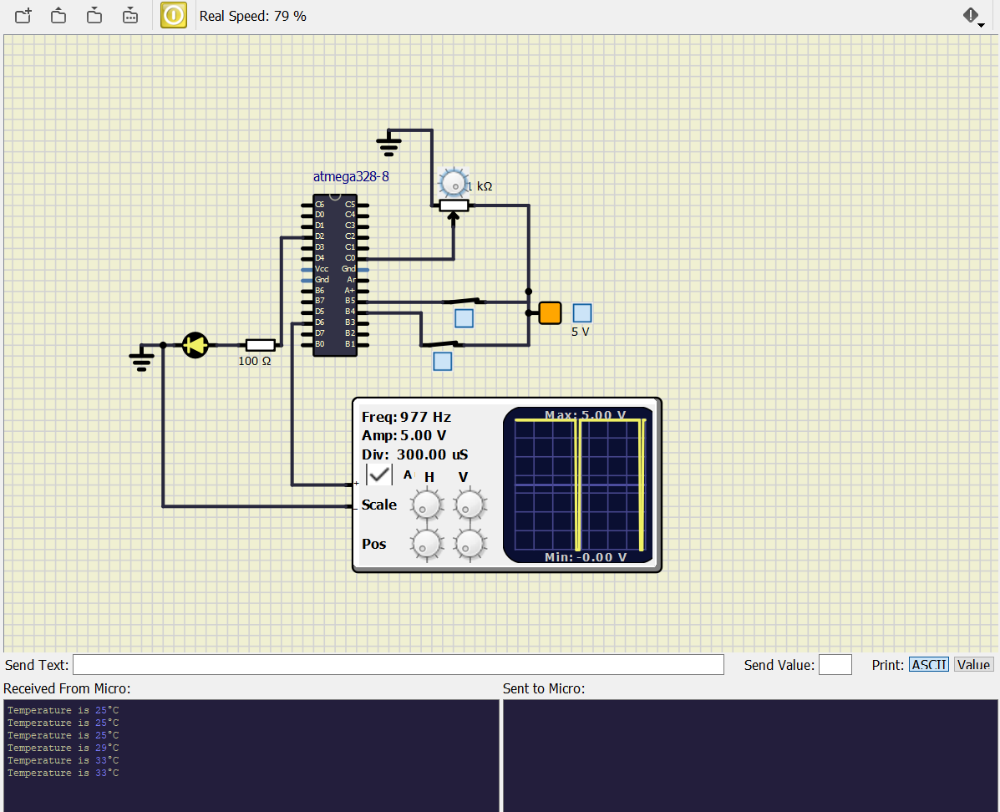

# Embedded C Programming Examples with Continuous Integration and Code Quality

# Passenger Heat Controller

## In Action

|Passenger not occupied seat|Passenger occupied seat & not switched on heater|Passenger occupied seat & switched on Heater|
|:--:|:--:|:--:|
||||

#### CI and Code Quality

|Build|Cppcheck|Codacy|
|:--:|:--:|:--:|
||||

## Wiki Documentation
* System [SETUP](https://github.com/Bharathgopal/Emb-C/wiki)
