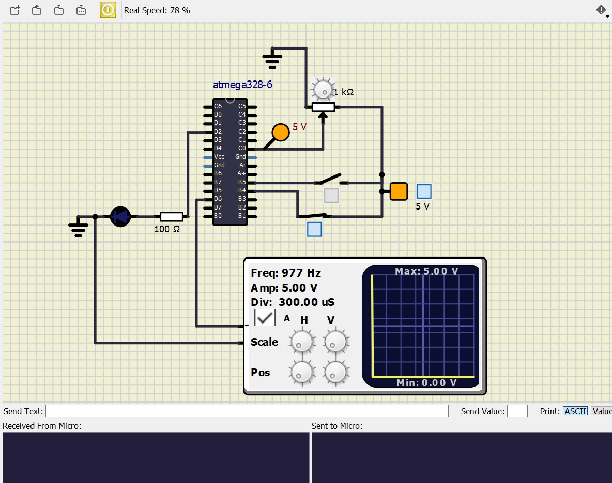
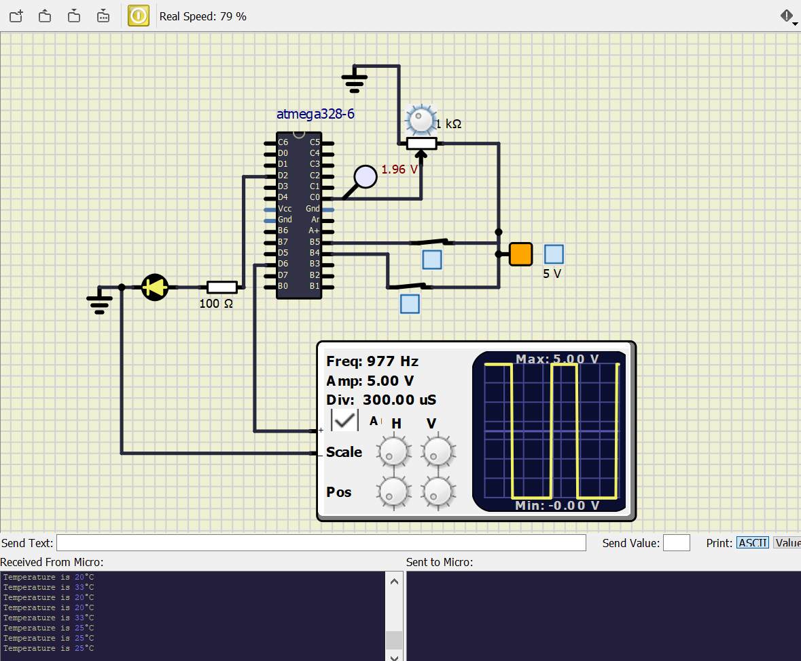

# Embedded C Programming Project with Continuous Integration and Code Quality

## Passenger Heat Controller

### Outputs based on Passenger Occupancy & Heater status 

|Passenger not occupied seat|Passenger occupied seat & not switched on heater|
|:--:|:--:|
|||

### Outputs based on Heater(ON state) Temperature status after Passenger occupied the seat

|At 20°C (20% Dutycycle)|At 25°C (40% Dutycycle)|At 29°C (70% Dutycycle)|At 33°C (95% Dutycycle)|
|:--:|:--:|:--:|:--:|
|||||

### CI and Code Quality

|Build|Cppcheck|Codacy|
|:--:|:--:|:--:|
||||